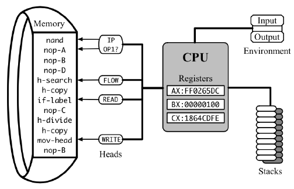
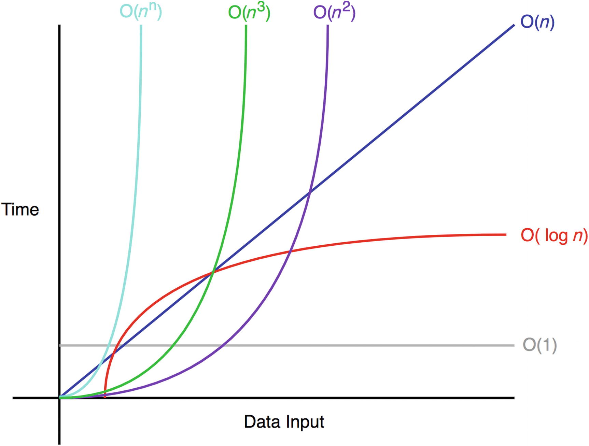

컴퓨터 과학 교과서를 펼쳐본 적이 있다면, 아마 아주 초반부에 *계산 복잡도(computational complexity)*에 대한 소개를 보았을 것입니다. 간단히 말해, 복잡도는 계산 중에 실행되는 *기본 연산*(덧셈, 곱셈, 읽기, 쓰기...)의 총 횟수이며, 선택적으로 각 연산의 *비용*에 따라 가중치가 부여됩니다.

복잡도는 오래된 개념입니다. 이는 1960년대 초반에 [체계적으로 공식화](http://www.cs.albany.edu/~res/comp_complexity_ams_1965.pdf)되었으며, 그 이후로 알고리즘을 설계하는 비용 함수로 보편적으로 사용되어 왔습니다. 이 모델이 이토록 빠르게 채택된 이유는 당시 컴퓨터가 작동하던 방식과 상당히 유사했기 때문입니다.

### 고전적 복잡도 이론 (Classical Complexity Theory)

CPU의 "기본 연산"은 *명령어(instructions)*라고 불리며, 그 "비용"은 *지연 시간(latencies)*이라고 합니다. 명령어는 *메모리*에 저장되고 프로세서에 의해 하나씩 실행됩니다. 프로세서는 여러 개의 *레지스터*에 저장된 내부 *상태*를 가집니다. 이 레지스터 중 하나는 *명령어 포인터(instruction pointer)*로, 다음에 읽고 실행할 명령어의 주소를 나타냅니다. 각 명령어는 프로세서의 상태를 특정 방식으로 변경하고(명령어 포인터를 이동시키는 것을 포함), 메인 메모리를 수정할 수 있으며, 다음 명령어를 시작하기 전까지 완료하는 데 서로 다른 수의 *CPU 사이클*이 걸립니다.

프로그램의 실제 실행 시간을 추정하려면 실행된 명령어의 모든 지연 시간을 합산하고 이를 *클록 주파수(clock frequency)*, 즉 특정 CPU가 초당 수행하는 사이클 수로 나누어야 합니다.

클록 주파수는 CPU 모델, 운영 체제 설정, 현재 마이크로칩 온도, 다른 구성 요소의 전력 사용량 및 기타 여러 요인에 따라 달라지는 휘발성 있고 종종 알 수 없는 변수입니다. 반면, 명령어 지연 시간은 정적이며 클록 사이클로 표현될 때 서로 다른 CPU 간에도 어느 정도 일관성을 유지하므로, 분석 목적으로는 이를 계산하는 것이 훨씬 더 유용합니다.

예를 들어, 정의에 따른 행렬 곱셈 알고리즘은 총 $n^2 \cdot (n + n - 1)$번의 산술 연산을 필요로 합니다. 구체적으로 $n^3$번의 곱셈과 $n^2 \cdot (n - 1)$번의 덧셈입니다. 이러한 명령어들의 지연 시간을 ([이것](https://www.agner.org/optimize/instruction_tables.pdf)과 같은 *명령어 표*에서) 찾아보면, 예를 들어 곱셈은 3사이클, 덧셈은 1사이클이 걸린다는 것을 알 수 있습니다. 따라서 전체 계산을 위해 총 $3 \cdot n^3 + n^2 \cdot (n - 1) = 4 \cdot n^3 - n^2$ 클록 사이클이 필요합니다 (이러한 명령어에 적절한 데이터를 "공급"하기 위해 수행해야 하는 다른 모든 작업은 무시했을 때의 수치입니다).

명령어 지연 시간의 합이 클록에 독립적인 총 실행 시간의 대리 지표(proxy)로 사용될 수 있는 것처럼, 계산 복잡도는 특정 컴퓨터의 선택에 의존하지 않고 추상적인 알고리즘의 본질적인 시간 요구 사항을 수량화하는 데 사용될 수 있습니다.

### 점근적 복잡도 (Asymptotic Complexity)

실행 시간을 입력 크기의 함수로 표현하는 아이디어는 지금은 당연해 보이지만, 1960년대에는 그렇지 않았습니다. 당시 [전형적인 컴퓨터](https://en.wikipedia.org/wiki/CDC_1604)는 수백만 달러의 비용이 들었고, 별도의 방이 필요할 정도로 컸으며, 킬로헤르츠 단위로 측정되는 클록 속도를 가졌습니다. 컴퓨터는 일기 예보, 로켓 발사, 또는 쿠바 해안에서 발사된 소련의 핵미사일이 얼마나 멀리 날아갈 수 있는지 계산하는 것과 같은 당면한 실제 작업에 사용되었습니다. 이 모든 것들은 유한한 길이의 문제입니다. 당시의 엔지니어들은 $n \times n$ 행렬보다는 $3 \times 3$ 행렬을 곱하는 방법에 주로 관심을 가졌습니다.

변화의 원동력은 컴퓨터가 계속해서 더 빨라질 것이라는 컴퓨터 과학자들의 확신이었고, 실제로 그렇게 되었습니다. 시간이 흐르면서 사람들은 실행 시간을 계산하는 것을 그만두었고, 그다음에는 사이클을 계산하는 것을, 그리고 심지어는 연산 횟수를 정확히 계산하는 것조차 그만두었습니다. 대신 충분히 큰 입력에 대해 상수 배 이내의 오차만 허용하는 *추정치*로 대체했습니다. *점근적 복잡도*를 사용하면, 장황한 "$4 \cdot n^3 - n^2$ 연산"은 평이한 "$\Theta(n^3)$"으로 변하며, 개별 연산의 초기 비용은 하드웨어의 다른 복잡한 세부 사항들과 함께 "빅 오(Big O)" 안에 숨겨지게 되었습니다.

점근적 복잡도를 사용하는 이유는 단순함을 제공하면서도, 대규모 데이터셋에서 알고리즘의 상대적 성능에 대한 유용한 결과를 산출할 수 있을 만큼 충분히 정밀하기 때문입니다. 컴퓨터가 결국 *충분히 큰* 입력을 합리적인 시간 내에 처리할 수 있을 만큼 빨라질 것이라는 약속 아래, 점근적으로 더 빠른 알고리즘은 숨겨진 상수와 관계없이 실시간으로도 항상 더 빠를 것입니다.

하지만 이 약속은 적어도 클록 속도와 명령어 지연 시간 측면에서는 사실이 아님이 밝혀졌습니다. 이 장에서는 그 이유와 대응 방법에 대해 설명할 것입니다.
