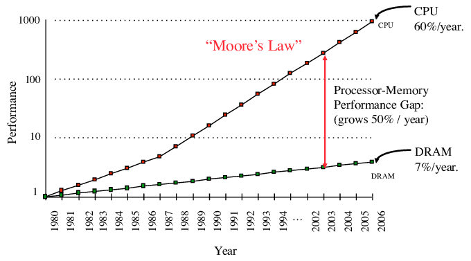

두 숫자를 더하는 데 시간이 얼마나 걸릴까요? 가장 자주 사용되는 명령어 중 하나인 `add` 자체는 실행하는 데 단 한 사이클만 소요됩니다. 따라서 데이터가 이미 레지스터에 로드되어 있다면 단 한 사이클이 걸립니다.

하지만 일반적인 경우(`*c = *a + *b`)에는 먼저 메모리에서 피연산자를 가져와야 합니다.

```nasm
mov eax, DWORD PTR [rsi]
add eax, DWORD PTR [rdi]
mov DWORD PTR [rdx], eax
```

<!--

메모리에서 무언가를 가져올 때, 요청은 주소 변환 유닛과 캐싱 계층으로 구성된 매우 복잡한 시스템을 통과하며, 데이터가 그 중 어디에도 없으면 요청은 칩 외부의 임시(RAM) 또는 영구(HDD, SSD) 메모리로 전달됩니다. 이로 인해 전체 지연 시간은 [칩의 어느 부분에 물리적으로 위치하는지](https://randomascii.wordpress.com/2022/01/12/5-5-mm-in-1-25-nanoseconds/)와 같은 많은 요인에 의해 영향을 받습니다.

-->

메모리에서 무언가를 가져올 때, 데이터가 도착하기까지는 항상 어느 정도의 지연 시간이 존재합니다. 또한 요청은 최종 저장 위치로 직접 가는 것이 아니라, 메모리 관리를 돕고 지연 시간을 줄이기 위해 설계된 주소 변환 유닛과 캐싱 계층의 복잡한 시스템을 먼저 거칩니다.

따라서 이 질문에 대한 유일한 정답은 "상황에 따라 다르다"입니다. 주로 피연산자가 어디에 저장되어 있는지에 따라 달라집니다.

- 데이터가 메인 메모리(RAM)에 저장되어 있다면, 데이터를 가져오는 데 약 ~100ns(약 200 사이클)가 소요되고, 다시 쓰는 데 또 다른 200 사이클이 소요됩니다.
- 최근에 액세스했다면 아마도 *캐시*되어 있을 것이며, 얼마나 오래 전에 액세스했는지에 따라 데이터를 가져오는 데 그보다 적은 시간이 걸립니다. 가장 느린 캐시 계층의 경우 ~50 사이클, 가장 빠른 계층의 경우 약 4-5 사이클이 걸릴 수 있습니다.
- 하지만 하드 드라이브와 같은 일종의 *외부 메모리*에 저장되어 있을 수도 있으며, 이 경우 액세스하는 데 약 5ms, 즉 대략 $10^7$ 사이클(!)이 소요됩니다.

메모리 성능의 이러한 높은 변동성은 메모리 하드웨어가 CPU 칩과 동일한 [실리콘 스케일링 법칙](/hpc/complexity/hardware)을 따르지 않기 때문에 발생합니다. 메모리는 여전히 다른 수단을 통해 개선되고 있지만, 50년 전에는 메모리 타이밍이 명령어 지연 시간과 대략 비슷한 수준이었으나 오늘날에는 훨씬 뒤처져 있습니다.



제한 요인을 줄이기 위해 현대의 메모리 시스템은 점차 [계층화](hierarchy)되고 있으며, 상위 계층은 지연 시간을 줄이는 대신 용량의 일부를 희생합니다. 계층 간에 이러한 특성이 수십 배씩 차이 날 수 있기 때문에(특히 외부 메모리 유형의 경우), 많은 메모리 집약적 알고리즘에서는 다른 무엇보다 I/O 작업을 최적화하는 것이 중요해졌습니다.

이로 인해 *외부 메모리 모델(external memory model)*이라는 새로운 비용 모델이 만들어졌습니다. 이 모델의 유일한 기본 작업은 블록 읽기 및 쓰기이며, 제한된 크기의 로컬 메모리에 저장된 데이터와 관련된 작업이라면 그 외의 모든 작업은 비용이 0입니다. 이는 *외부 메모리 알고리즘*이라는 흥미로운 새로운 분야를 탄생시켰으며, 이번 장에서 이를 공부할 것입니다.

<!--

최적화가 더욱 중요해지고 있습니다.

현대의 컴퓨터는 더욱 강력해지고 있지만, 메모리 시스템은 CPU 칩과 동일한 [실리콘 스케일링 법칙](/hpc/complexity/hardware)을 따르지 않기 때문에 컴퓨팅 성능의 증가를 따라잡지 못하고 있습니다.

CPU 코어의 주파수가 3 GHz라면, "작업"이 무엇인지에 따라 초당 최대 $3 \cdot 10^9$번의 작업을 수행할 수 있다는 것을 의미합니다. 이것이 기준입니다. 현대의 아키텍처에서는 계산이 허용하는 한 SIMD 및 명령어 수준 병렬 처리와 같은 기술을 통해 초당 최대 $10^{11}$번의 작업까지 늘릴 수 있습니다.

하지만 많은 알고리즘에서 병목 현상은 CPU가 아닙니다. 기준 이상의 성능을 최적화하기 전에 먼저 그 기준 아래로 떨어지지 않는 법을 배워야 하며, 그 첫 번째 이유는 메모리입니다.

-->
