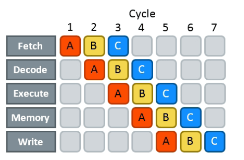

프로그래머들이 *병렬성(parallelism)*이라는 단어를 들으면, 대부분 공통의 문제를 해결하기 위해 계산을 세미-독립적인 *스레드(threads)*로 명시적으로 나누는 관행인 *멀티코어 병렬성*을 생각합니다.

이러한 유형의 병렬성은 주로 *지연 시간(latency)*을 줄이고 *확장성(scalability)*을 달성하는 것에 관한 것이지, *효율성(efficiency)*을 향상시키는 것에 관한 것이 아닙니다. 병렬 알고리즘을 사용하면 10배 더 큰 문제를 해결할 수 있지만, 적어도 10배 더 많은 계산 리소스가 필요합니다. 병렬 하드웨어가 [점점 더 풍부해지고](/hpc/complexity/hardware) 병렬 알고리즘 설계가 점점 더 중요한 분야가 되고 있지만, 지금은 단일 CPU 코어만 고려하는 것으로 제한하겠습니다.

하지만 단일 CPU 코어 내부에는 이미 *무료로* 사용할 수 있는 다른 유형의 병렬성이 존재합니다.

<!--

This technique only applies 

Parallel hardware is now everywhere. When you opened this page in your browser, it was retrieved by a 50-core server CPU, then parsed by an 8-core desktop CPU, and then rendered by a 400-core GPU. Not all cores were involved with serving you this page at all times — they might have been doing something else.

Parallelism helps in reducing *latency*. It is important, but for now, our main concern is not *scalability*, but *efficiency* of algorithms.

Sharing computations is an art in itself, but for now, we want to learn how to use resources that we already have more efficiently.

While multi-core parallelism is "cheating," many form of parallelism exist "for free."

Adapting algorithms for parallel hardware is important for achieving *scalability*. In the first part of this book, we will consider this technique "cheating." We only do optimizations that are truly free, and preferably don't take away resources from other processes that might be running concurrently.

-->

### 명령어 파이프라이닝 (Instruction Pipelining)

*어떤* 명령어를 실행하기 위해서든 프로세서는 먼저 다음과 같은 많은 준비 작업을 수행해야 합니다:

- 메모리에서 기계어 코드 덩어리를 **가져오고(fetching)**,
- 이를 **디코딩(decoding)**하여 명령어로 나누고,
- 이러한 명령어를 **실행(executing)**하며(여기에는 일부 **메모리** 작업이 포함될 수 있음),
- 결과를 다시 레지스터에 **기록(writing)**합니다.

이 모든 작업 시퀀스는 *깁니다*. 두 개의 레지스터에 저장된 값을 함께 `add`하는 것과 같은 간단한 작업조차도 최대 15-20 CPU 사이클이 소요됩니다. 이러한 지연 시간을 숨기기 위해 현대 CPU는 *파이프라이닝(pipelining)*을 사용합니다. 명령어가 첫 번째 단계를 통과한 후, 이전 명령어가 완전히 완료될 때까지 기다리지 않고 즉시 다음 명령어 처리를 시작합니다.

파이프라이닝은 *실제* 지연 시간을 줄이지는 않지만, 기능적으로는 마치 실행 및 메모리 단계로만 구성된 것처럼 보이게 만듭니다. 여전히 15-20 사이클을 지불해야 하지만, 실행하려는 명령어 시퀀스를 찾은 후에는 한 번만 지불하면 됩니다.

이를 염두에 두고 하드웨어 제조업체는 CPU 설계의 주요 성능 지표로 "평균 명령어 지연 시간" 대신 *명령어당 사이클(CPI, cycles per instruction)*을 사용하는 것을 선호합니다. *유용한* 명령어만 고려한다면 알고리즘 설계에도 [꽤 좋은 지표](/hpc/profiling/benchmarking)입니다.

완벽하게 파이프라이닝된 프로세서의 CPI는 1에 수렴해야 하지만, 각 파이프라인 단계를 복제하여 "넓게" 만들어 한 번에 하나 이상의 명령어를 처리할 수 있게 하면 실제로는 1보다 낮아질 수도 있습니다. 캐시와 대부분의 ALU를 공유할 수 있기 때문에, 이는 완전히 분리된 코어를 추가하는 것보다 저렴합니다. 사이클당 하나 이상의 명령어를 실행할 수 있는 이러한 아키텍처를 *슈퍼스칼라(superscalar)*라고 하며, 대부분의 현대 CPU가 이에 해당합니다.

명령어 스트림에 별도로 처리될 수 있는 논리적으로 독립적인 작업 그룹이 포함된 경우에만 슈퍼스칼라 처리의 이점을 누릴 수 있습니다. 명령어가 항상 가장 편리한 순서로 도착하는 것은 아니므로, 가능할 때 현대 CPU는 전반적인 활용도를 높이고 파이프라인 스톨(stall)을 최소화하기 위해 명령어를 *비순차적(out of order)*으로 실행할 수 있습니다. 이 마법이 어떻게 작동하는지는 더 심화된 논의<!--[a more advanced discussion](scheduling)--> 주제이지만, 지금은 CPU가 미래의 일정 거리까지 보류 중인 명령어 버퍼를 유지하고, 피연산자의 값이 계산되고 실행 유닛을 사용할 수 있게 되는 즉시 실행한다고 가정할 수 있습니다.

### 교육 비유

우리 교육 시스템이 어떻게 작동하는지 생각해 보세요:

1. 주제는 개인보다는 학생 그룹에게 가르칩니다. 모든 사람에게 동시에 같은 내용을 방송하는 것이 더 효율적이기 때문입니다.
2. 학생 입학은 서로 다른 교사가 이끄는 그룹으로 나뉩니다. 과제 및 기타 코스 자료는 그룹 간에 공유됩니다.
3. 매년 같은 코스가 새로운 신입생에게 교육되어 교사가 계속 바쁘게 일할 수 있도록 합니다.

이러한 혁신은 전체 시스템의 *처리량(throughput)*을 크게 증가시키지만, *지연 시간*(특정 학생의 졸업까지 걸리는 시간)은 변하지 않습니다(개별 튜터링이 더 효과적이기 때문에 약간 늘어날 수도 있습니다).

현대 CPU와 많은 비유를 찾을 수 있습니다:

1. CPU는 [SIMD 병렬성](/hpc/simd)을 사용하여 서로 다른 데이터 포인트 블록(16, 32 또는 64바이트로 구성됨)에 대해 동일한 작업을 실행합니다.
2. 다른 CPU 시설을 공유하면서 이러한 명령어를 동시에 처리할 수 있는 여러 실행 유닛(실행 단위)이 있습니다(대체로 2-4개).
3. 명령어는 파이프라인 방식으로 처리됩니다(유치원에서 박사 학위 사이의 연수와 거의 같은 수의 사이클을 절약함).

<!-- You can continue "up:" there are multiple school branches (cores), multiple schools (computers), etc. -->

그 외에도 몇 가지 다른 측면도 일치합니다:

- 실행 경로는 시간이 지남에 따라 더 분기되고 다른 실행 유닛이 필요하게 됩니다.
- 일부 명령어는 다양한 이유로 스톨될 수 있습니다.
- 일부 명령어는 심지어 투기적으로(미리) 실행되지만 나중에 폐기되기도 합니다.
- 일부 명령어는 자체적으로 진행될 수 있는 여러 개의 별도 마이크로 연산(micro-operations)으로 나뉠 수 있습니다.

파이프라이닝 및 슈퍼스칼라 프로세서를 프로그래밍하는 것은 그 자체로 도전 과제를 제시하며, 이 장에서 이를 다룰 것입니다.
